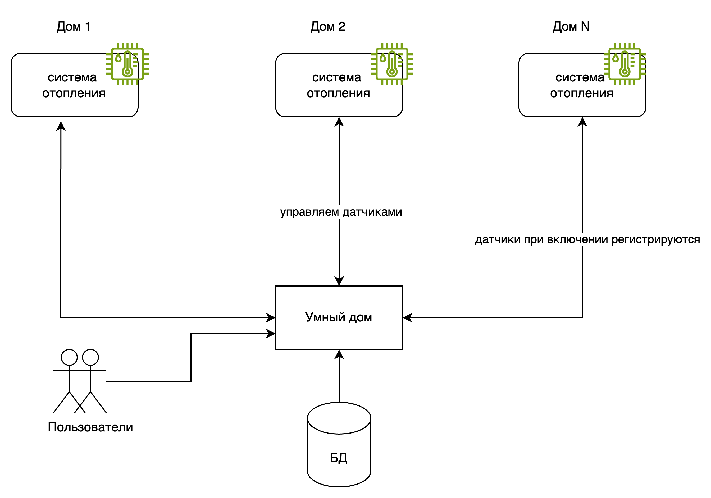

# Project_template

# Задание 1. Анализ и планирование

## Текущее решение
«Тёплый дом» — это небольшая компания, которая организует удалённое управление отоплением в доме. 


* Нынешнее приложение компании позволяет только управлять отоплением в доме и проверять температуру.
* Каждая установка сопровождается выездом специалиста по подключению системы отопления в доме к текущей версии системы.
* Архитектура приложения представляет из себя монолит на Go с СУБД Postgres. Всё синхронно. Никаких асинхронных вызовов, микросервисов и реактивного взаимодействия в системе нет. Всё управление идёт от сервера к датчику. Данные о температуре также получаются через запрос от сервера к датчику.
* Самостоятельно подключить свой датчик к системе пользователь не может.





### 1. Описание функциональности монолитного приложения

**Управление отоплением:**

- Пользователи могут…
- Система поддерживает…
- …

**Мониторинг температуры:**

- Пользователи могут…
- Система поддерживает…
- …

### 2. Анализ архитектуры монолитного приложения

Перечислите здесь основные особенности текущего приложения: какой язык программирования используется, какая база данных, как организовано взаимодействие между компонентами и так далее.

#### Технический стек

* Язык программирования Go
* БД Postgresql
* Развертывание приложения Docker compose
* 

#### Архитектура приложения

* Приложение представляет собой монолит предоставляющий REST API
* Зависимости описаны в отдельном файле
* Приложение слабо реализует логгирование
* Качество обработки ошибок мне сложно оценить
* Структура приложения разделена на функциональные блоки
* Сущности не выделены. Есть структуры данных которые являются контрактом между обработчиком запросов и функцией БД
* Слой работы с БД, представлен набором функций реализующих CRUD
* Контроллеры представляют собой набор функций связанных с запросом
* Настройка БД принимается как переменная окружения

Считаю что для текущего масштаба этого достаточно, но для развития такая архитектура затруднит развитие. Добавление сущности - это создание структуры для обмена данными обработчик запроса - БД, и набора функций обработчика и БД. Для операций CRUD две структуры и восемь новых функций.

SQL CRUD пишется руками, что тоже считаю проблемой. 

Признаться код и структура БД не покрывает описания функциональности приложения, в частности неясно как производится привязка к дому. Возможно это есть один из фатальных недостатков системы.  


### 3. Определение доменов и границы контекстов

Домен
* Контроль и управление температурой в доме

Поддомены
* Добавление\Редактирование\Удаление датчика
* Получение текущих показаний температуры датчика
* Управление отоплением. Включение\выключение, установка желаемой температуры 

Поддомены не выражены в реализации.

### **4. Проблемы монолитного решения**

В рамках текущих требований не вижу проблем с тем что приложение монолит.

### 5. Визуализация контекста системы — диаграмма С4

Добавьте сюда диаграмму контекста в модели C4.
[As Is Context.puml](docs/As%20Is%20Context.puml)


# Задание 2. Проектирование микросервисной архитектуры

В этом задании вам нужно предоставить только диаграммы в модели C4. Мы не просим вас отдельно описывать получившиеся микросервисы и то, как вы определили взаимодействия между компонентами To-Be системы. Если вы правильно подготовите диаграммы C4, они и так это покажут.

**Диаграмма контейнеров (Containers)**

Добавьте диаграмму.

**Диаграмма компонентов (Components)**

Добавьте диаграмму для каждого из выделенных микросервисов.

**Диаграмма кода (Code)**

Добавьте одну диаграмму или несколько.

# Задание 3. Разработка ER-диаграммы

Добавьте сюда ER-диаграмму. Она должна отражать ключевые сущности системы, их атрибуты и тип связей между ними.

# Задание 4. Создание и документирование API

### 1. Тип API

Укажите, какой тип API вы будете использовать для взаимодействия микросервисов. Объясните своё решение.

### 2. Документация API

Здесь приложите ссылки на документацию API для микросервисов, которые вы спроектировали в первой части проектной работы. Для документирования используйте Swagger/OpenAPI или AsyncAPI.

# Задание 5. Работа с docker и docker-compose

Перейдите в apps.

Там находится приложение-монолит для работы с датчиками температуры. В README.md описано как запустить решение.

Вам нужно:

1) сделать простое приложение temperature-api на любом удобном для вас языке программирования, которое при запросе /temperature?location= будет отдавать рандомное значение температуры.

Locations - название комнаты, sensorId - идентификатор названия комнаты

```
	// If no location is provided, use a default based on sensor ID
	if location == "" {
		switch sensorID {
		case "1":
			location = "Living Room"
		case "2":
			location = "Bedroom"
		case "3":
			location = "Kitchen"
		default:
			location = "Unknown"
		}
	}

	// If no sensor ID is provided, generate one based on location
	if sensorID == "" {
		switch location {
		case "Living Room":
			sensorID = "1"
		case "Bedroom":
			sensorID = "2"
		case "Kitchen":
			sensorID = "3"
		default:
			sensorID = "0"
		}
	}
```

2) Приложение следует упаковать в Docker и добавить в docker-compose. Порт по умолчанию должен быть 8081

3) Кроме того для smart_home приложения требуется база данных - добавьте в docker-compose файл настройки для запуска postgres с указанием скрипта инициализации ./smart_home/init.sql

Для проверки можно использовать Postman коллекцию smarthome-api.postman_collection.json и вызвать:

- Create Sensor
- Get All Sensors

Должно при каждом вызове отображаться разное значение температуры

Ревьюер будет проверять точно так же.


